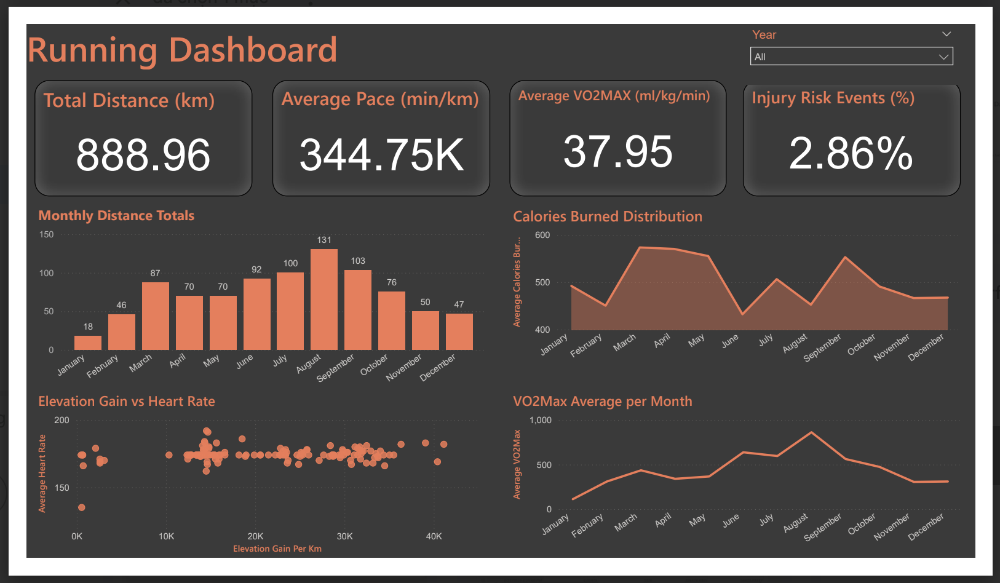
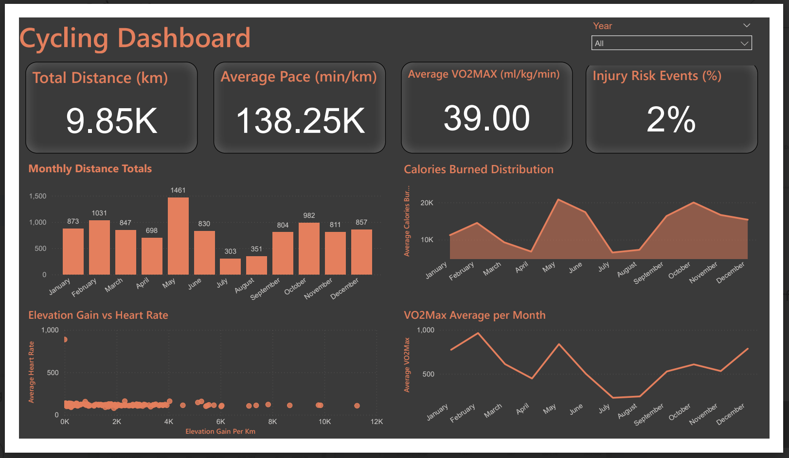
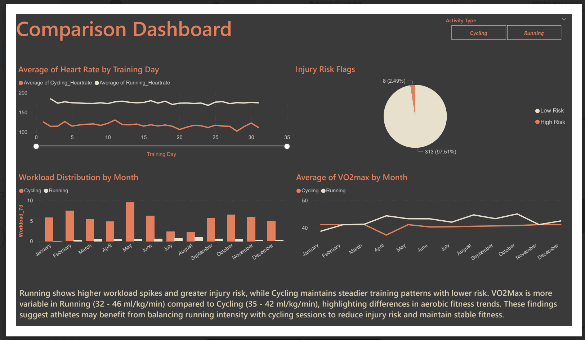

# 🏃🚴 Project B – Athlete Performance Analysis

## 📌 Introduction

This project analyzed endurance activities (Running & Cycling) to build predictive models, track training loads, estimate VO₂Max, and assess injury risks.
The goal was to provide actionable insights for athletes and coaches, with outputs integrated into PowerBI dashboards for monitoring and decision-making.

## ⚙️ Methodology
### 1. Data Preparation

- Cleaned raw activity datasets (running & cycling).
- Converted durations into seconds.
- Engineered features:
    - Pace per km, Elevation gain per km, Weather Index.
    - Rolling 7-day workload to capture training load trends.
    - Injury risk flag (>30% workload spikes).
    - Recovery flag (pace returning within 5% of baseline).

### 2. Modelling

- Applied Random Forest and Gradient Boosting regressors for duration prediction.
- Conducted hyperparameter tuning (GridSearchCV).
- Used 5-fold cross-validation for evaluation.
- Removed outliers to improve model stability.

### 3. VO₂Max Estimation

- Running → ACSM speed-based equation:
        VO₂Max = 3.5 + (0.2 × speed in m/min)

- Cycling → FTP-based equation:
        VO₂Max = (10.8 × FTP / body weight) + 7

- Compared VO₂Max distributions across sports.

### 4. Visualisations

- Pace trends, monthly distances, calories burned distribution.
- Elevation gain vs heart rate, workload vs injury risk.
- VO₂Max distribution histograms.
- Exported datasets for PowerBI integration.

## 📊 Results

### 🏃Running

- Model Performance: After outlier removal, Random Forest achieved R² ≈ 0.97, showing excellent predictive stability.
- VO₂Max Range: 33-42 ml/kg/min, showing wider variability.
- Workload Patterns: Sharper spikes, linked to increased injury risk.

### 🚴Cycling

- Model Performance: Random Forest & Gradient Boosting achieved R² ≈ 0.96–0.98.
- VO₂Max Range: 33–42 ml/kg/min, narrower and more stable.
- Workload Patterns: More gradual increases, with lower injury risk volatility.

### Comparison

- Running offers higher aerobic stress but greater injury risk.
- Cycling provides stable aerobic fitness with reduced strain.
- Cross-training the two optimizes both performance and safety.

## 📊 PowerBI Dashboards

Three interactive dashboards were built in PowerBI:

### 🏃 Running Dashboard

- KPI cards: Total distance, Average pace, Average VO₂Max, Injury Risk events.
- Monthly distance totals (bar chart).
- Calories burned distribution (area chart).
- Elevation gain vs heart rate (scatterplot).
- VO₂Max distribution trends.

### 🚴 Cycling Dashboard

- KPI cards: Total distance, Average pace, Average VO₂Max, Injury Risk events.
- Monthly distance totals (bar chart).
- Calories burned distribution (area chart).
- Elevation gain vs heart rate (scatterplot).
- VO₂Max distribution trends.

### ⚖️ Comparison Dashboard

- Slicer: Activity Type (Running vs Cycling).
- Heart rate comparison line chart.
- Pie chart of low vs high injury risk events.
- Workload distribution by month.
- VO₂Max trends across sports.
- Text summary box for training insights.

These dashboards allow athletes and coaches to interactively explore training data, identify risks, and track performance over time.

## 🔍 Insights

- Outliers significantly impact predictive models — removing them boosted R² from 0.78 → 0.97.
- VO₂Max differences between sports reflect physiology: running drives variability, cycling maintains steady endurance.
- Injury risk is strongly workload-driven — sudden >30% mileage spikes in running lead to high-risk flags.
- Dashboards enable proactive training management by tracking pace trends, VO₂Max, and injury indicators.

## 🎯 Overall Conclusion

Running builds aerobic capacity but carries higher injury risk due to workload spikes, while cycling offers more stable fitness development.
A balanced combination of both provides the best pathway for sustainable performance improvement.

